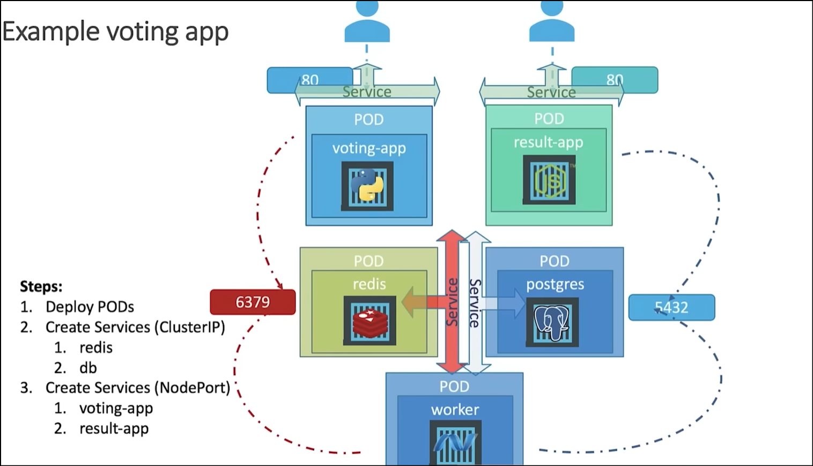
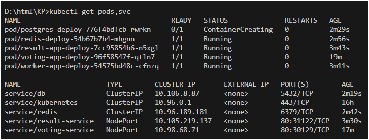

Containerized Voting System with Docker & Kubernetes Orchestration
=========

A simple distributed application running across multiple Docker containers.

## Docker Integration

Pulled and utilized pre-built Docker images from Docker Hub to implement a fully functional voting system, integrating multiple microservices.

## Kubernetes Deployment

Created YAML configuration files for Kubernetes, defining deployments and services for each microservice including the Voting App, Redis (for caching), Worker (for background task processing), Database (for persistence), and Result App (for displaying voting results).

## Container Orchestration

Managed inter-service communication and ensured proper scaling and service exposure through Kubernetes services, enabling seamless orchestration of containers.

## Hands-on Kubernetes Features

Explored deployment scaling, auto-restarting failed containers, and load balancing traffic to ensure high availability and scalability of the voting system.

Architecture
-----

* A front-end web app in [Python](/vote) or [ASP.NET Core](/vote/dotnet) which lets you vote between two options
* A [Redis](https://hub.docker.com/_/redis/) or [NATS](https://hub.docker.com/_/nats/) queue which collects new votes
* A [.NET Core](/worker/src/Worker), [Java](/worker/src/main) or [.NET Core 2.1](/worker/dotnet) worker which consumes votes and stores them in…
* A [Postgres](https://hub.docker.com/_/postgres/) or [TiDB](https://hub.docker.com/r/dockersamples/tidb/tags/) database backed by a Docker volume
* A [Node.js](/result) or [ASP.NET Core SignalR](/result/dotnet) webapp which shows the results of the voting in real time

Dataflow Diagram
-----

Pods & Services
-----

